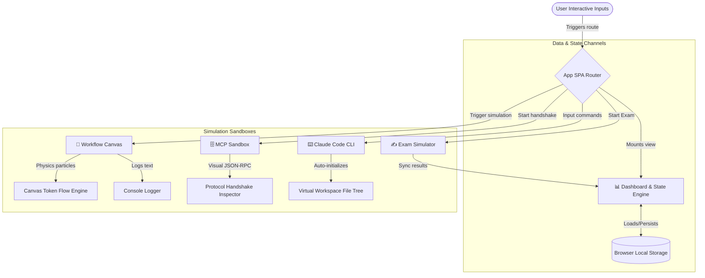

# Claude Certified Architect (CCA) Foundations: Prep & Lab Portal

[](https://opensource.org/licenses/MIT)
[](https://pages.github.com/)
[](https://developer.mozilla.org/)

An interactive, space-grade, and visually stunning open-source laboratory and mock preparation system designed to help developers master the new Anthropic **Claude Certified Architect (CCA) Foundations** certification.

Experience advanced LLM system architectures, multi-agent frameworks, Model Context Protocol (MCP) specifications, and Claude Code workspace workflows directly inside your browser.

---

## 🌟 Interactive Key Features

| Domain Module | Interactive Capabilities | Architectural Goal |
| :--- | :--- | :--- |
| **📊 Syllabus Dashboard** | Real-time progress trackers across 5 core domains, session elapsed duration, high scores, average performances, and **intelligent diagnostic recommendations** identifying specific technical weaknesses. | Dynamic progress analytics |
| **✍️ 301-level Exam Simulator** | Full shuffled timed exam limits (20 mins, 15 items) and an untimed **Study Mode** delivering instant detailed feedback, reasoning rationale, and strict prefix cache configurations. | Scenario reasoning training |
| **🧪 Agentic Workflow Canvas** | visual canvas simulating **Orchestrator-Workers**, **Intelligent Routing**, and **Evaluator-Optimizer Loops** with high-performance particle streams representing "token flow", scrollable consoles, and cost counters. | Visualizing token flow dynamics |
| **🗄️ MCP Protocol Sandbox** | Step-by-step handshake diagram showcasing how hosts negotiate `tools/list` and `tools/call` JSON-RPC 2.0 requests and tool schema outputs with SQLite and File System servers. | Demystifying MCP integrations |
| **⌨️ Claude Code CLI Terminal** | Full terminal mimicking Claude Code (`claude init`, `claude test`, `claude commit`) with a virtual workspace directory file-tree updating live as you run refactor scripts. | Mastering agentic CLI tools |

---

## 🛠️ Architecture Flowchart

Below is a system layout showing how components in this Single-Page Application (SPA) are orchestrated seamlessly with full browser compatibility:



---

## 🚀 Local Deployment in 60 Seconds

This project is built using native **ES Modules**, modern **CSS Custom Properties**, and standard **HTML5 elements**. It is 100% self-contained and requires **zero dependencies or npm build pipelines**.

### Option A: Launch using Python
Open your command terminal inside the project root and spin up the standard HTTP server:
```bash
python -m http.server 8000
```
Then navigate to: **[http://localhost:8000](http://localhost:8000)**

### Option B: Launch using Node.js
If you prefer Node utility scripts, serve it instantly:
```bash
npx serve .
```
Then open: **[http://localhost:3000](http://localhost:3000)**

### Option C: Manual Launch
Simply double-click the `index.html` file to open it in your browser directly via the `file://` protocol. (All modules operate perfectly!).

---

## 📂 Repository Packaging Details

To make this a turnkey template, the project includes:
- **`.github/workflows/deploy.yml`**: Triggers auto-deployment to GitHub Pages immediately upon push to `main` or `master`.
- **`CLAUDE.md`**: Provides standardized development commands, styles, HSL color tokens, and structural rules.
- **`LICENSE`**: MIT open-source authorization keys.

---

## 🎓 Claude Certified Architect (301-level) Domains Covered
1. **System Architecture & Design**: Prompt Caching constraints, asynchronous parallel summaries, and retry strategies using exponential backoff with jitter.
2. **Claude Ecosystem**: Selection parameters across Haiku (latency/low-cost), Sonnet (sota coding/reasoning), and Opus; Prompt Caching prefix mechanics.
3. **Model Context Protocol (MCP)**: JSON-RPC standards, host-client-server transport (STDIO/SSE), Prompts vs. Resources vs. Tools.
4. **Agentic Workflows**: Multi-agent routing logic, Evaluator-Optimizer feedback cycles, and Orchestrator-Worker sub-delegations.
5. **Safety & Production Quality**: Input pre-shields, output post-filters using dual-model guardrails, and human-in-the-loop validation designs.

---

## ⚖️ License
Distributed under the **MIT License**. See `LICENSE` for details.
